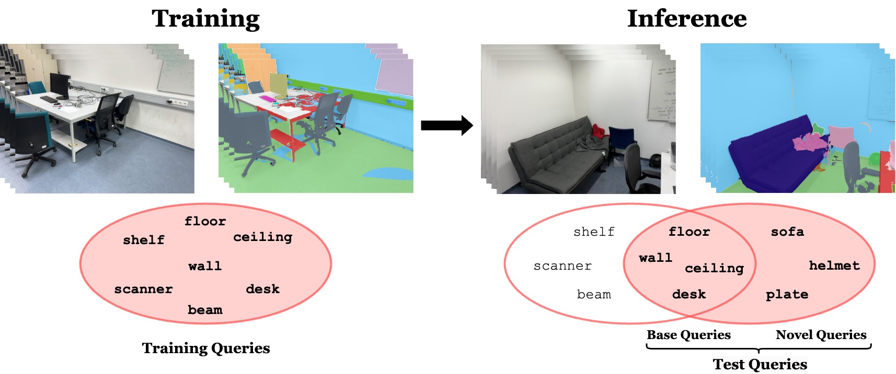

# OpenDAS
## Domain Adaptation for Open-Vocabulary Segmentation 

<a href="https://goncayilmaz.github.io/">Gonca Yilmaz</a>1,2, &nbsp;&nbsp;&nbsp;
<a href="https://pengsongyou.github.io/">Songyou Peng</a>1, &nbsp;&nbsp;&nbsp; 
 
<a href="https://francisengelmann.github.io/">Francis Engelmann</a>1,3, &nbsp;&nbsp;&nbsp; 
<a href="https://people.inf.ethz.ch/pomarc/">Marc Pollefeys</a>1,4,&nbsp;&nbsp;&nbsp;
<a href="https://hermannblum.net/">Hermann Blum</a>1,5,&nbsp;&nbsp;&nbsp;

1ETH Zürich&nbsp;&nbsp;&nbsp;&nbsp;
2University of Zurich&nbsp;&nbsp;&nbsp;&nbsp;
3Microsoft&nbsp;&nbsp;&nbsp;&nbsp;
4Google&nbsp;&nbsp;&nbsp;&nbsp;
5Lamarr Institute / Uni Bonn&nbsp;&nbsp;&nbsp;&nbsp;

<h2 class="title is-3">BibTeX</h2>
    <pre>
    <code>
    @inproceedings{yilmaz2024opendas,
      title={{OpenDAS: Domain Adaptation for Open-Vocabulary Segmentation}},
      author={Yilmaz, Gonca and Peng, Songyou and Engelmann, Francis and Pollefeys, Marc and Blum, Hermann},
      year={2024}
    }
    </code>
    </pre>
    

  

